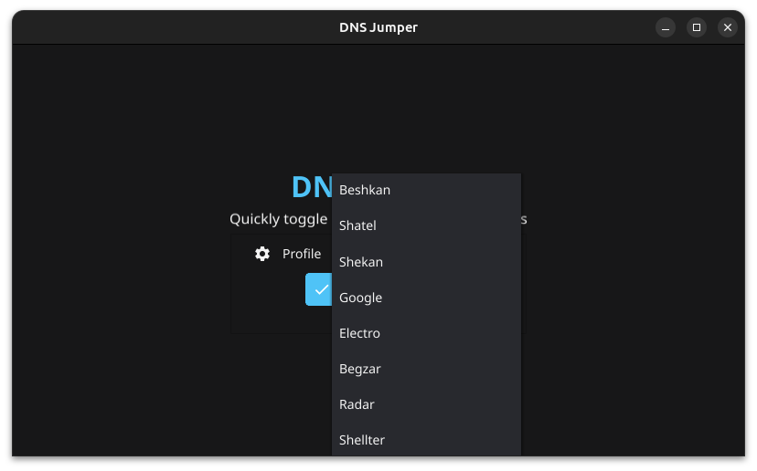
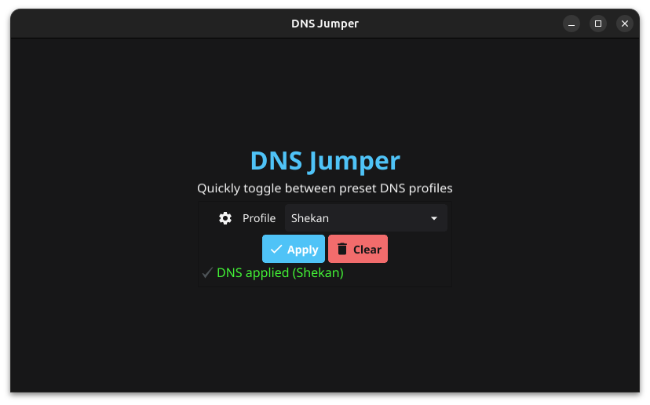
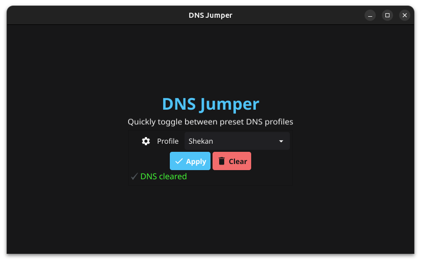

# DNS Jumper

A simple cross-platform GUI application (Linux & Windows) to quickly switch DNS profiles or clear DNS settings.

---

## Features
- Pick and apply predefined DNS profiles  
- Clear current DNS settings with one click  
- Works on Linux and Windows  
- Simple, lightweight interface  

---

## Screenshots

  
  

  
  

---

## Installation
1. Go to the **Releases** page.  
2. Download the build for your operating system and architecture (**amd64** or **arm64**).  
3. Extract the downloaded archive.  
4. Run the application — no installation required.  
   - On **Windows**, run the application as **Administrator**.  
   - On **Linux**, just open the application.

## Usage
1. Select a DNS profile from the dropdown  
2. Click **Apply** to set it  
3. Click **Clear** to restore default DNS  
