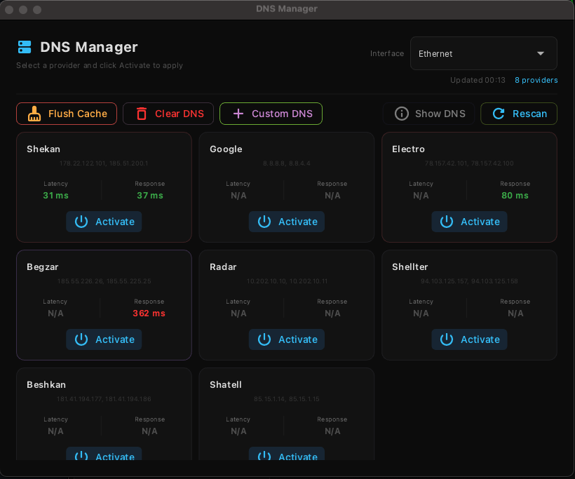

# IR DNS Jumper

A cross-platform DNS manager with a dark-themed GUI — built with Python and [Flet](https://flet.dev).  
Quickly benchmark, switch, and manage DNS providers without touching system settings manually.

<p align="center">
  
</p>

---

## Features

- **Benchmark** — measures latency and DNS response time for every provider in parallel
- **One-click activate** — sets the chosen DNS on your active network interface
- **Built-in Iranian providers** — Shekan, Electro, Begzar, Radar, Shellter, Beshkan, Shatell
- **Custom DNS** — add any DNS by IP, stored permanently in `~/.dns_manager_custom.json`
- **Flush cache** — clears the local DNS cache without changing DNS settings
- **Clear DNS** — reverts to automatic (DHCP) DNS with a confirmation prompt
- **Cross-platform** — macOS, Windows, Linux

---

## Requirements

- Python 3.10+
- pip packages listed in `requirements.txt`

```bash
pip install -r requirements.txt
```

---

## Run

```bash
python gui-dns.py
```

> **macOS / Linux** — commands that change DNS settings (`networksetup`, `nmcli`, etc.) are
> invoked with `sudo` on-demand. Your terminal may ask for your password the first time.
>
> **Windows** — the app auto-triggers a **UAC prompt** at startup if it isn't already running
> as Administrator. `netsh` requires admin rights to modify DNS settings.

---

## Platform Details

| Action | macOS | Windows | Linux |
|---|---|---|---|
| List interfaces | `networksetup` | `netsh interface show` | `nmcli` / `ip link` |
| Set DNS | `networksetup -setdnsservers` | `netsh interface ip set dns` | `nmcli con mod` |
| Flush cache | `dscacheutil` + `mDNSResponder` | `ipconfig /flushdns` | `resolvectl` / `systemd-resolved` |
| Clear DNS | `networksetup … empty` | `netsh … dhcp` | `nmcli con mod ipv4.dns ""` |

---

## Custom DNS

Click **Custom DNS** in the toolbar, enter a name and one or two IP addresses.  
The entry is saved to `~/.dns_manager_custom.json` and survives restarts.  
To remove it, click the trash icon on the card.

---

## License

MIT
